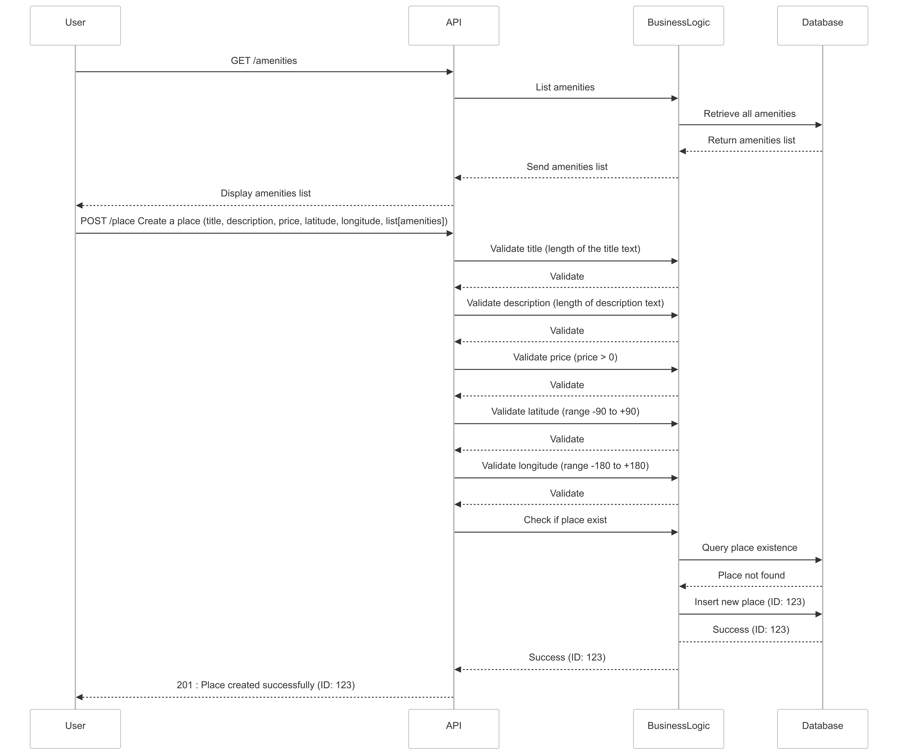

# HBNB PROJECT

## This document will regroup:

- Presentation of the HBnB project
- Presentation of the team
- Technical Document:
 - - High-level package diagram
 - - Detailed Class Diagram
 - - Sequence diagram

---

## Presentation of the HBnB project

As students in development at Holberton School, we put into practice our knowledge in a project.
The project of the second trimester is to produce a clone of AirBnB called HBnB.

### What is AirBnB?

AirBnB is a service company that provides a platform to connect people who rent out part of their home with private individuals looking for accommodation.

### The key features of the AirBnB website are:

#### For people who rent:
- Create a page for their home and specify the location, amenities, price, availability dates, etc.

#### For people who want to rent:
- Select a place and date and view a list of available rentable homes.

Of course, there are many additional features derived from these two key concepts, which will be explained later in dedicated diagrams.

---

## The team is composed of:
- Ali MEDJNOUN 
- Warren NGOUABI 
- Simon REGNIER 

---

## High-Level Package Diagram

### Disclaimer
Due to some misunderstandings regarding this part of the project, we decided to provide a diagram that represents what we have understood about the architecture of the site, even though we acknowledge that it does not strictly follow the formal rules for producing a Package Diagram.

### Objective:
This diagram describes the architecture of the app (layered architecture).

### Overview:

#### Presentation Layer (Front-end):
- Manages interaction between clients and services through the API.

- The Facade centralizes communication between client and business layer.
  
This layer contains the user interface and API

#### Business Layer (Back-end):
- Contains the core business logic of the application and the class models.

This layer works with User, Place, Review, and Amenity.
The data is retrieved and stored in the DataBase.

#### Persistence Layer (Back-end):
- Manages data storage and retrieval.

This layer contains the DB.

## Detailed Class Diagram

### Objective:
- Detail the "business layer."
- Define the architecture of this layer.
- Present the features of the app.

According to the specifications, we will use an OOP architecture and a Facade Pattern to centralize communication between the client and the business layer. 
The OOP architecture allows us to avoid code duplication by using a base model class and inheritance.

### Overview and Details:

#### Facade 
- Centralize communication between client and business layer.

#### BaseModel (abstract class)
- Provides a common base for all other objects.
- We added validation methods to ensure every input used in the app is properly validated.

#### User
- Stores user information.
- Open question regarding permissions management (admin access).
- Registrer is different from user creation, because only an admin can create a user from scratch, while regular customers must register their own accounts.
- The method for validating email is placed in `User` and not in the `BaseModel` because only the `user needs to validate an email.

#### Place
- Associates a place with an owner.
- Includes geographical and pricing attributes.

#### Amenity_entity
- Manages the available amenities that can be added to the amenity list of each place.

#### Review
- Manages 5-star reviews, including the author and the concerned place.

### Return of Methods:
- Boolean values (`True/False`) to indicate whether an action was successful or failed.

### Miscellaneous :
- Even if some methods in different classes seem similar, we prefer to distinguish them (one per class) because their constraints are not the same.
**Exemple**
A description, a comment, a password, and a name are all strings, but their length limits and specific constraints differ for each one.

- The sequence diagrams enabled us to see that certain validations were needed, and following these diagrams we implemented the methods for validating each object.

---

## Sequence diagram

You will find the corresponding sequence diagrams below :

 - User Registration: A user signs up for a new account.
 - Place Creation: A user creates a new place listing.
 - Review Submission: A user submits a review for a place.
 - Fetching a List of Places: A user requests a list of places based on certain criteria.

For these diagram, we consider the main success scenario (aka happy path)

### User Registration

- Step 1 : User submit registration details (email, password, first_name, last_name)
- Step 2 : API validate email format (e.g. check if there is an @ with regex)
- Step 3 : API validates the password format with security requirements (e.g., at least 8 characters long, includes an uppercase letter, a number, etc.).
- Step 4 : API validates first name and last name (Must be string, and not contains numbers)
- Step 5 : Check if email already exist and query email existence with DB
- Step 6 : If no match with an existing email : insert a new user in the DB.
- Step 7 : Return information to user with success message

---

### Place creation
We consider User is already logged.

First, we must load the list of available amenities to propose a list of amenity for the user.

- Step 1 : API call to get list of amenities.
- Step 2 : API retrieve the amenities list from database
- Step 3 : Once Amenities list is loaded, user can create a new place (title, description, price, latitude, longitude, amenities)
- Step 4 : API Validate title (e.g. must be a string, at least 8 characters long)
- Step 5 : API Validate description (e.g. must be less than 3000 characters long)
- Step 6 : API validate price (must be positive)
- Step 7 : API validate coordinates (latitude (in range -90 to +90) and longitude (range -180 + 180))
- Step 8 : Check if the place already exist
- Step 9 : Query place existence in DB
- Step 10 : If no match with an existing place : insert a new place in the DB
- Step 11 : Return information to user with success message

---

### Review submission
We consider User is already logged.
We consider that the message must be validated by an admin to prevent comments containing insults, for example.

- Step 1 : User submit a review (review, place, date)
- Step 2 : API validate review (e.g. length of the reviewing text must be less than 1000 characters long)
- Step 3 : API validate date (e.g. date format or date in the future)
- Step 4 : Check if the review already exist (same place, same date, from same user)
- Step 5 : Query review existence in DB
- Step 6 : If review is not found, create a new review
- Step 7 : Return information to user with success message
- Step 8 : A user with admin permission valide the review (review ID, validation)
- Step 9 : Validate review
- Step 10 : Database is updated with to indicate this review is validated
- Step 11 : Return information to admin user with success message

---

### Fetching place
We consider User is already logged.

- Step 1 : User search for a place with some criteria
- Step 2 : Validate search (criteria more than 0)
- Step 3 : Check if places with these criteria exist
- Step 4 : Querry and fetch list of place in DB with these criteria
- Step 5 : Return information to user with sucess message

